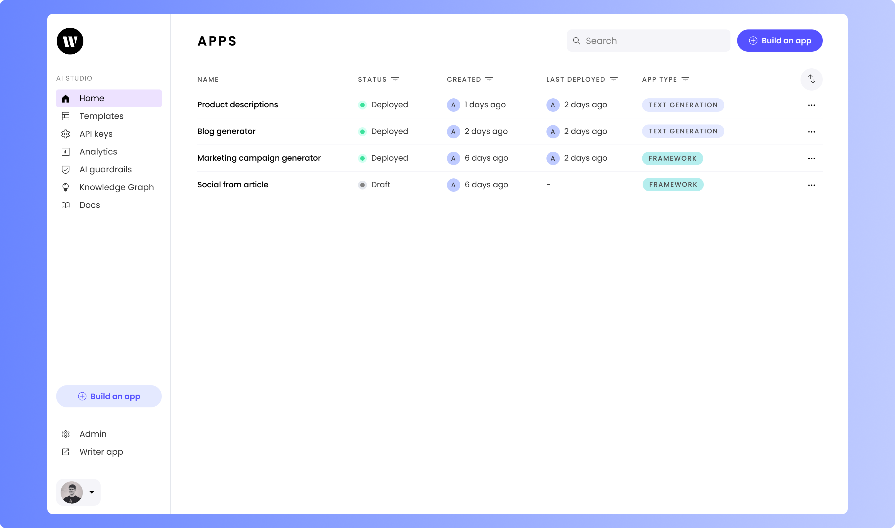
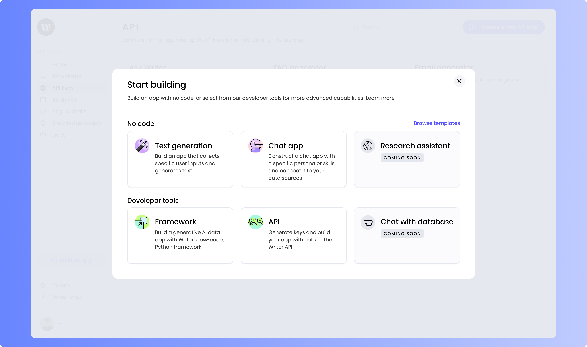

# Framework quickstart: Chat assistant

In this guide, you'll create a simple yet powerful chat assistant using the Writer Framework. In a matter of minutes, you'll put together an AI-powered chatbot that can engage in conversations on various topics, provide answers to your questions, and maybe even help you when you're experiencing writer's block! You'll do this using a drag-and-drop visual editor to build the user interface and Python for the back-end code.

If you're new to the Writer Framework, don't worry — we'll take it step by step!

Here's what the finished chat assistant will look like:


## What you'll learn

By following this guide, you will learn:

- How to set up a Writer Framework application.
- How to use Python and the Writer API to create a chat assistant.
- How to build a user interface using Writer Framework's drag-and-drop tools.
- How to deploy your application to the Writer cloud.


## Prerequisites

Before starting, ensure you have:

- **A Writer account:** Create a free account at [writer.com](https://writer.com).
- **Python 3.7+**: Use the installer from [python.org](https://www.python.org/downloads/).
- **pip:** This command-line application comes with Python and is used for installing Python packages, including those from Writer.
- **Your favorite code editor:** You’ll need one — such as Visual Studio Code, Notepad++, Vim, Emacs, or any text editor made for programming — to write the back-end code behind the user interface.
- **A basic understanding of Python:** You should be familiar with the basics of the language.


## Step 1: Get your Writer Framework API key

To build the chat assistant app, you'll need a Writer Framework API key. This is different from the Writer SDK API Key; it's specific to the Writer Framework.

If you already have a Writer Framework API Key, you can skip this section.

1. **Create a new app:** On the Writer home screen, click **_Build an app_**.


2. **Select the *Framework* option:** Under **_Developer tools_**, choose **_Framework_**.


3. **Get Your API Key:** _Authenticate with an API key_, click _Reveal key_ to display your API key. Use the "copy" button that appears to copy the API key.

   * (Optional) You can rename your app by clicking on the app name at the top left, making it easier to find and remember.


## Step 2: Set up the environment and create the project

The next step is to set up Writer Framework environment on your computer. You'll do this by creating a directory for the project, installing dependencies, and creating the project for the application using a template.

1. **Create the Project Directory:** Open a terminal application ("Terminal" on macOS and Linux, "Windows PowerShell" or "Command Prompt" on Windows) and enter the following commands:

    ```
    mkdir chat-assistant-app
    cd chat-assistant-app
    ```

    * This will create a new directory for the chat assistant app project and then enter that directory.

2. **Install dependencies:** Install the `writer` and `python-dotenv` packages using `pip`. Enter the following commands in your terminal application:

    ```
    pip install writer python-dotenv
    ```

   * The `writer` package enables Python code to interact with Writer and the Writer Framework.
   * The `python-dotenv` package makes it easy to manage environment variables by loading them from a `.env` file.

3. **Create a .env File:** Using your code editor, create a file named `.env` — short for "environment," and it's where the application will get the values for its environment variables — in your project directory. 
   
   Enter the following into the file, replacing `[your_api_key]` with the API key you copied earlier:

    ```
    WRITER_API_KEY=[your_api_key]
    ```

    The chat application will read the API key from this file and use the key to access the Writer Framework. Don’t forget to save it!

4. **Create the project:** Use the Writer Framework template to create the project by entering this command into your terminal application:

    ```
    writer create chat-assistant --template=ai-starter
    ```

    This command sets up a new project called "chat-assistant" using a starter template.


## Step 3: Build the user interface (UI)

Now that you've created the project, it's time to define the UI. The Writer Framework's drag-and-drop capabilities make it easy — even if you haven't done much UI work before!

Open the Project Editor by typing the following into your terminal application:

```
writer edit chat-assistant
```

This will open the Writer editor, which is a web application running on your computer. Access by opening your browser and entering `localhost:3006` in the address bar.

You'll see the **canvas** in the center, which displays the app’s user interface. The column on the left contains the ***Toolkit*** containing all the user interface components and the ***Component tree*** that shows the arrangement of the UI components on the canvas. If you select a user interface item in the canvas, a ***Properties*** panel appears on the right side of the page.

It's time to build the UI!

1. **Header:**
  The *Header* component should already be present. We'll update its title in the code later.

2. **Section:**
   - Click on the existing *Section* component. You’ll see a *Properties* panel appear on the right side of the page. It lets you view and edit the properties of the selected component.
   - In the *Properties* panel, find the *Title* property (near the top of the panel, under *General*) and clear out the *Section*’s default title.

3. **Text:**
   - Drag a *Text* component from the *Toolkit* panel on the left (it’s under *Content*, and you may need to scroll down a little) and into the *Section*.
   - Select the *Text* component. Once again, the *Properties* panel should appear.
   - In the *Properties* panel, set the *Text* component’s *Text* property to provide instructions or context for your chat assistant. Here's an example: `Welcome to the Chat Assistant. Ask me anything!`

4. **Chatbot:**
   - Drag a *Chatbot* component from the *Toolkit* panel into the *Section*, just below the Text box.

Your UI should now look similar to this:


## Step 4: Add backend logic

With the UI laid out, it's time to work on the logic behind it. Switch to your code editor and open the `main.py` file in your project's directory. This file contains the code that defines the application's behavior.

1. **Import libraries and load the Writer Framework API key:** Open `main.py` in your code editor. You should see the following at the start of the file:

    ```python
    import writer as wf
    import writer.ai
    ```

    Replace that code with the following:

    ```python
    import os
    from dotenv import load_dotenv
    import writer as wf
    import writer.ai

    # Load environment variables from .env file
    load_dotenv()

    # Set the API key
    wf.api_key = os.getenv("WRITER_API_KEY")
    ```

    This code imports the libraries that the application will need and then reads your Writer Framework API key from the `.env` file in your project's directory.

2. **Initialize the application:** The next step is to set the application’s initial state. Find this code:

    ```python
    # Welcome to Writer Framework! 
    # This template is a starting point for your AI apps.
    # More documentation is available at https://dev.writer.com/framework


    # Initialise the state
    wf.init_state({
        "my_app": {
            "title": "AI STARTER"
        },
    })
    ```

    ...and replace it with the following:

    ```python
    # Initialize the state
    wf.init_state({
        "conversation": writer.ai.Conversation(),
        "my_app": {
            "title": "Chat Assistant"
        },
    })
    ```

    The Writer Framework’s `init_state()` method sets the initial value of `state`, a dictionary containing values that define the state of the application.

    The code above sets the initial value of `state` so that it has two key-value pairs:

    - `conversation`: An object that keeps a record of the conversation that the user is having with the LLM. You’ll bind its value to the _Chatbot_ component, which will display the conversation and take the user’s input.
    - `my_app`: A dictionary containing values that define the application's appearance. This dictionary has a single key-value pair, `title`, which defines the text that appears as the application’s title.

3. **Respond to the user's input:** The application needs a function to handle incoming chat messages. Add the following to the end of `main.py`:

    ```python
    def generate_completion(state, payload):
        print(f"Here's what the user entered: {payload['content']}")
        state["conversation"] += payload
        print(f"Conversation: {state['conversation'].messages}")
        try:
            for index, chunk in enumerate(state["conversation"].stream_complete()):
                print(f"Chunk {index}: {chunk}")
                if not chunk.get("content"):
                    chunk["content"] = ""
                state["conversation"] += chunk
                
            print(f"state['conversation']:\n{state['conversation'].messages}")
        except Exception as e:
            print(f"Error during stream_complete: {e}")
    ```

    Some notes about this function:

    - The `handle_simple_message()` function will be called when the user enters a prompt, which is contained in the `payload` object. The `payload` object is  added to the `conversation` object contained in the application's `state`, which adds the user's prompt to the record of the conversation between the user and the LLM.
    - After adding the user's prompt to the conversational record, `handle_simple_message()` calls the `conversation` object’s `stream_complete()` method, which generates an LLM completion based on the conversation so far. As its name implies, `stream_complete()` returns the completion as a stream of text chunks, which are captured and added to the `conversation` object.

### The final code
Here's what the final code in `main.py` should look like:

```python
import os
from dotenv import load_dotenv
import writer as wf
import writer.ai

# Load environment variables from .env file
load_dotenv()

# Set the API key
wf.api_key = os.getenv('WRITER_API_KEY')

wf.init_state({
    "conversation": writer.ai.Conversation(),
    "my_app": {
        "title": "CHAT ASSISTANT"
    },
})


def generate_completion(state, payload):
    print(f"Here's what the user entered: {payload['content']}")
    state["conversation"] += payload
    print(f"Conversation: {state['conversation'].messages}")
    try:
        for index, chunk in enumerate(state["conversation"].stream_complete()):
            print(f"Chunk {index}: {chunk}")
            if not chunk.get("content"):
                chunk["content"] = ""
            state["conversation"] += chunk
            
        print(f"state['conversation']:\n{state['conversation'].messages}")
    except Exception as e:
        print(f"Error during stream_complete: {e}")
```

## Step 5: Bind the UI to the backend code

You've built the UI and written the code behind it. Let's connect the two!

Go back to the browser window where you were building the UI and do the following:

1. **Bind the _Chatbot_ component to the `conversation` object.** Recall that the `conversation` object contained within the application's `state` variable contains the record of the conversation that the user is having with the LLM. Binding the _Chatbot_ component to this object allows it to display the conversation to the user.

    Select the _Chatbot_ component. In the _Properties_ panel on the right side of the page, find the _Conversation_ property and set its value to `@{conversation}`.

    The value `@{conversation}` specifies that the _Chatbot_ component should get its information from the value corresponding to the `conversation` key in the application's `state` variable.

    

2. **Specify the _Chatbot_ component's event handler.** You need to specify that the _Chatbot_ component should call the `generate_completion()` function when the user enters a prompt. Do this by scrolling down the _Properties_ panel to the _Events_ section until you see a property called _`wf_chatbot_message`_. Select `generate_completion` from its menu.

    

## Step 6: Run the application locally

The application is ready to run locally!

Switch back your terminal application. Either stop the editor with ctrl-c or open a new terminal window, then run the application by entering the following command:

```
writer run chat-assistant
```

This will start the application, which you can access with your browser at the URL that appears on the command line.

> [!NOTE] 
Note that the Writer editor (opened with `writer edit chat-assistant`) and your application (launched with `writer run chat-assistant`) runs on the same URL, but on different *ports* (specified by the number after the `:` character at the end of the URL).

## Step 7: Deploy the application (optional)

Right now, your application will only run on your computer. To make it available online, you'll need to deploy it to the Writer Cloud.

In your terminal application, you can either stop the editor with ctrl-c or open a new terminal window. Deploy your application by entering the following command:

```
writer deploy chat-assistant
```

You'll be asked to enter your Writer Framework API key. Once you do that, the writer command-line application will start deploying your application to the Writer Cloud. The process should take a couple of minutes.

Once the app has been deployed to the Writer Cloud, you'll be shown the URL for your application, which you can use to access it online.


## Conclusion

That's it — you've built a functional chat assistant using the Writer Framework! 

Feel free to modify this project! The Writer platform is flexible enough for you to customize, extend, and evolve your application into something completely different! To find out what else you can do, check out the documentation for [Writer Framework](https://dev.writer.com/framework/introduction) and the [Writer API](https://dev.writer.com/framework/introduction).
