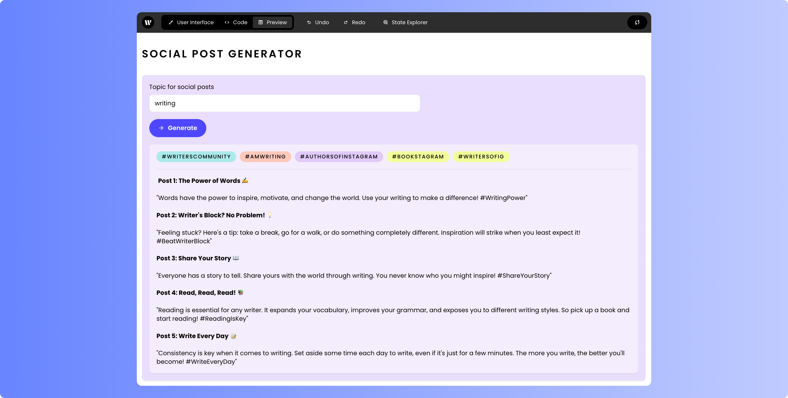
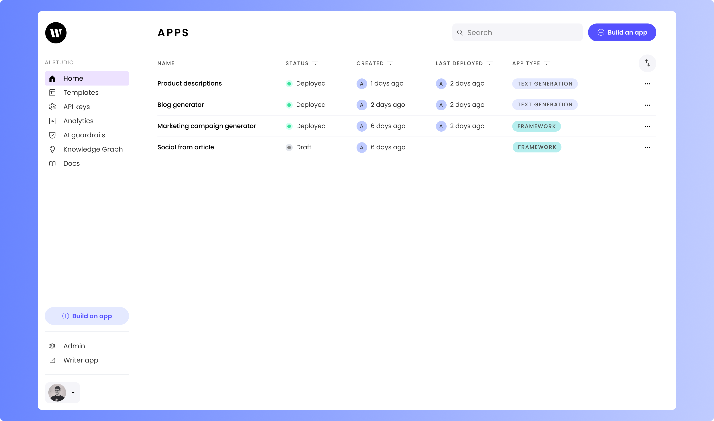
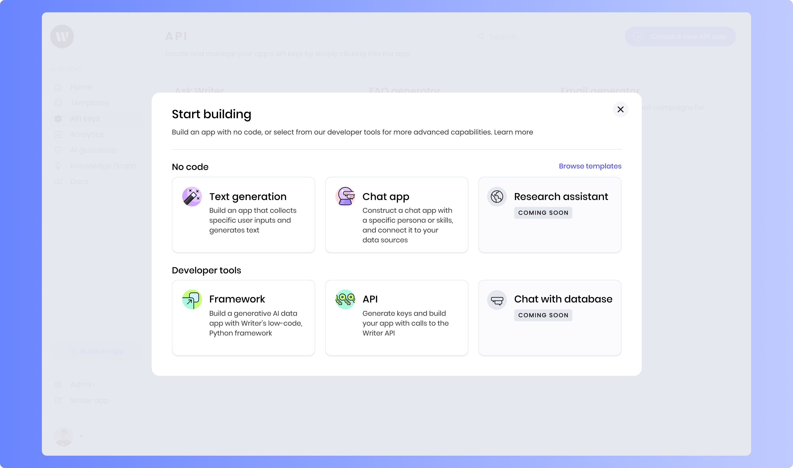
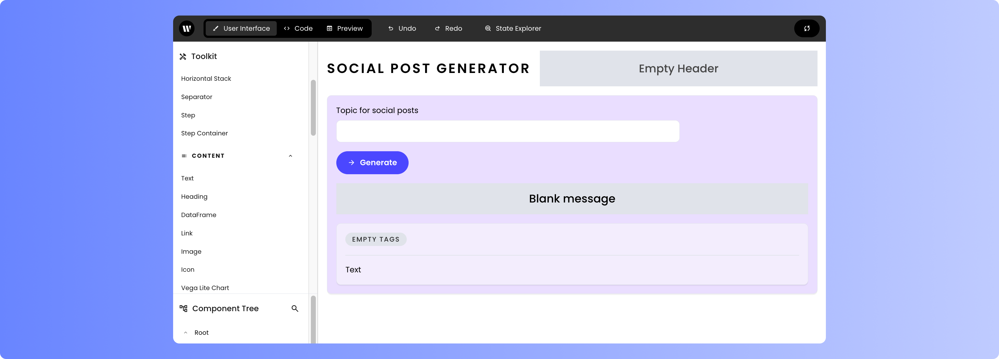

# Framework quickstart: Social post generator

In this guide, you'll create a simple yet powerful chat assistant using the Writer Framework. In a matter of minutes, you'll put together an AI-powered generator that can come up with social media posts and tags based on your input! You'll do this using a drag-and-drop visual editor to build the user interface and Python for the back-end code.

If you're new to the Writer Framework, don't worry — we'll take it step by step!

Here's what the finished social post generator will look like:




## What you'll learn

By following this guide, you will learn:

- How to set up a Writer Framework application.
- How to use Python and the Writer API to create a social post generator.
- How to build a user interface using Writer Framework's drag-and-drop tools.
- How to deploy your application to the Writer cloud.


## Prerequisites

Before starting, ensure you have:

- **A Writer account**: Create a free account at [writer.com](https://writer.com).
- **Python 3.7+**: Use the installer from [python.org](https://www.python.org/downloads/).
- **pip**: This command-line application comes with Python and is used for installing Python packages, including those from Writer.
- **Your favorite code editor**: You’ll need one — such as Visual Studio Code, Notepad++, Vim, Emacs, or any text editor made for programming — to write the back-end code behind the user interface.
- **A basic understanding of Python**: You should be familiar with the basics of the language.


## Step 1: Get your Writer Framework API key

To build the social post generator app, you'll need a Writer Framework API key. This is different from the Writer SDK API Key; it's specific to the Writer Framework.

If you already have a Writer Framework API Key, you can skip this section.

### How to get your Writer Framework API key

1. **Create a new app:** On the Writer home screen, click **_Build an app_**.


2. **Select the *Framework* option:** Under **_Developer tools_**, choose **_Framework_**.


3. **Get Your API Key:** _Authenticate with an API key_, click _Reveal key_ to display your API key. Use the "copy" button that appears to copy the API key.

   * (Optional) You can rename your app by clicking on the app name at the top left, making it easier to find and remember.


## Step 2: Set up the environment and create the project

The next step is to set up Writer Framework environment on your computer. You'll do this by creating a directory for the project, installing dependencies, and creating the project for the application using a template.

1. **Create the Project Directory:** Open a terminal application ("Terminal" on macOS and Linux, "Windows PowerShell" or "Command Prompt" on Windows) and enter the following commands:

    ```
    mkdir social-generator-app
    cd social-generator-app
    ```

  * This will create a new directory for the social post generator app project and then enter that directory.

2. **Install dependencies:** Install the `writer` and `python-dotenv` packages using `pip`. Enter the following commands in your terminal application:

    ```
    pip install writer python-dotenv
    ```

   * The `writer` package enables Python code to interact with Writer and the Writer Framework.
   * The `python-dotenv` package makes it easy to manage environment variables by loading them from a `.env` file.

3. **Create a .env File:** Using your code editor, create a file named `.env` — short for "environment," and it's where the application will get the values for its environment variables — in your project directory. 
   
   Enter the following into the file, replacing `[your_api_key]` with the API key you copied earlier:

    ```
    WRITER_API_KEY=[your_api_key]
    ```

    The chat application will read the API key from this file and use the key to access the Writer Framework. Don’t forget to save it!

4. **Create the project:** Use the Writer Framework template to create the project by entering this command into your terminal application:

    ```
    writer create social-post-generator --template=ai-starter
    ```

    This command sets up a new project called "chat-assistant" using a starter template.

## Step 3: Build the user interface (UI)

Now that you've created the project, it's time to define the UI. The Writer Framework's drag-and-drop capabilities make it easy — even if you haven't done much UI work before!

Open the Project Editor by typing the following into your terminal application:

```
writer edit social-post-generator
```

This will open the Writer editor, which is a web application running on your computer. Access by opening your browser and entering `localhost:3006` in the address bar.

You'll see the **canvas** in the center, which displays the app’s user interface. The column on the left contains the ***Toolkit*** containing all the user interface components and the ***Component tree*** that shows the arrangement of the UI components on the canvas. If you select a user interface item in the canvas, a ***Properties*** panel appears on the right side of the page.

It's time to build the UI! First, let's build the *input* part of the UI, where the user will provide input for the social post generator.

1. **Header:**
  The *Header* component should already be present. We'll update its title in the code later.

2. **Section:**
   - Click on the existing *Section* component. You’ll see a *Properties* panel appear on the right side of the page. It lets you view and edit the properties of the selected component.
   - In the *Properties* panel, find the *Title* property (near the top of the panel, under *General*) and clear out the *Section*’s default title.

3. **Text Input:**  
   - From the *Toolkit* panel on the left, drag a *Text Input* component (it’s under *Content*, and you may need to scroll down a little) into the *Section*.
   - Select the *Text Input* component. Once again, the *Properties* panel should appear.
   - In the *Properties* panel:  
     - Find the *Label* property and set its value to `Topic for social posts`.  
     - (Optional) Feel free to add some placeholder to the *Text Input* component by setting the value of the *Placeholder* with something like `Enter words or phrases describing your topic`.

4. **Button:**  
   - Drag a *Button* component from the *Toolkit* panel and place it in the *Section*, directly below the *Text Input*.
   - Select the *Button* component.
   - In the *Properties* panel:  
     - Set the *Text* property's value to `Generate posts`.  
     - Find the *Icon* property, and set its value to `arrow_forward`.

5. **Message:**  
   - Drag a `Message` component from the *Toolbox* panel and put it into the *Section*, positioning it immediately below the *Button*.
   - Select the *Message* component.  
   - In the *Properties* panel:   
     - Scroll down to the *Style* section and look for the *Loading* property, which sets the color of the *Message* component when it's loading.
     - Click its *Pick* button, which will cause a color strip to appear.
     - Click the color strip to enter the following values:
         - *R*: 212
         - *G*: 255
         - *B*: 242

It's now time to build the *output* part of the UI, where the application will display the social media posts and tags it generates.

1. **Section:**
   - Drag a *Section* component from the *Toolbox* panel and place it inside the *Section* that's already there, just below the *Messages* component.
   - Select the *Section* component you just added.   
   - In the *Properties* panel: 
     - Find the *Title* property and clear it its value to remove the *Section*'s title.
     - Scroll down to the *Style* section and look for the *Container background* property, which sets the background color of the *Section* component. 
     - Click its *Pick* button, which will cause a color strip to appear.
     - Click the color strip to enter the following values:
         - *R*: 246
         - *G*: 239
         - *B*: 253

2. **Separator:** Drag a *Separator* component from the *Toolbox* panel and place it inside the new *Section*.  

3. **Tags:** Drag a *Tags* component from the *Toolbox* panel and place it inside the new *Section*, below the Separator.
   
4. **Text:** Finally, drag a *Text* component from the *Toolbox* panel and position it below the *Tags* component.

Your UI should now look similar to this:




## Step 4: Add backend logic

With the UI laid out, it's time to work on the logic behind it. Switch to your code editor and open the `main.py` file in your project's directory. This file contains the code that defines the application's behavior.

1. **Import libraries and load the Writer Framework API key:** Open `main.py` in your code editor. You should see the following at the start of the file:

    ```python
    import writer as wf
    import writer.ai
    ```

    Replace that code with the following:

    ```python
    import os
    import re
    from dotenv import load_dotenv
    import writer as wf
    import writer.ai

    # Load environment variables from .env file
    load_dotenv()

    # Set the API key
    wf.api_key = os.getenv('WRITER_API_KEY')
    ```

    This code imports the libraries that the application will need and then reads your Writer Framework API key from the `.env` file in your project's directory.

2. **Initialize the application:** The next step is to set the application’s initial state. Find this code:

    ```python
    # Welcome to Writer Framework! 
    # This template is a starting point for your AI apps.
    # More documentation is available at https://dev.writer.com/framework


    # Initialise the state
    wf.init_state({
        "my_app": {
            "title": "AI STARTER"
        },
    })
    ```

    ...and replace it with the following:

    ```python
    # Initialize the state
    wf.init_state({
        "topic": "writing",
        "message": "",
        "tags": {},
        "posts": "",
        "my_app": {
            "title": "SOCIAL POST GENERATOR"
        }
    })
    ```

    The Writer Framework’s `init_state()` method sets the initial value of `state`, a dictionary containing values that define the state of the application.

    The code above sets the initial value of state so that it has these key-value pairs:

    - `topic`: A string containing the topic that the application should generate social media posts and tags for. You’ll bind its value to the _Text Input_ component where the user will enter the topic.
    - `message`: A string containing text of the message that will be displayed to the user while the application is generating posts and tags. You’ll bind its value to the _Message_ component.
    - `tags`: A list containing the hashtags generated by the LLM. You’ll bind its value to the _Tags_ component.
    - `posts`: A string containing the social media posts generated by the LLM. You’ll bind its value to the _Text_ component.
    - `my_app`: A dictionary containing values that define the application's appearance. This dictionary has a single key-value pair, `title`, which defines the text that appears as the application’s title.

3. **Respond to the user's input:** The application needs a function to handle incoming chat messages. Add the following to the end of `main.py`:

    ```python
    def generate_and_display_posts_and_tags(state):
        # Display message
        state["message"] = "% Generating social media posts and tags for you..."

        # Generate and display social posts
        prompt = f"You are a social media expert. Generate 5 engaging social media posts about {state['topic']}. Include emojis, and put a blank line between each post."
        state["posts"] = writer.ai.complete(prompt)

        # Generate and display hashtags
        prompt = f"You are a social media expert. Generate around 5 hashtags about {state['topic']}, delimited by spaces. For example, #dogs #cats #ducks #elephants #badgers"
        pattern = r"#\w+"
        hashtags = re.findall(pattern, writer.ai.complete(prompt))
        state["tags"] = {item: item for item in hashtags}

        # Hide message
        state["message"] = ""
    ```

    Some notes about this function:

    - The `%` at the start of the string being assigned to `state["message"]` will be replaced by a “spinning circle” progress indicator graphic in the _Message_ component.
    - The `pattern` variable in the `# Generate and display hashtags` section defines a regular expression pattern to search for words that begin with the `#` character. The `r` in front of the opening quote specifies that the string is a _raw string_, which means that the `\` character should be treated as a literal backslash and not as the start of an escape character sequence. 

### Final code in `main.py`

Here’s what the final code should look like in `main.py`:

```py
import os
import re
from dotenv import load_dotenv
import writer as wf
import writer.ai

# Load environment variables from .env file
load_dotenv()

# Set the API key
wf.api_key = os.getenv('WRITER_API_KEY')

# Initialize the state
wf.init_state({
    "topic": "writing",
    "message": "",
    "tags": {},
    "posts": "",
    "my_app": {
        "title": "SOCIAL POST GENERATOR"
    }
})


def generate_and_display_posts_and_tags(state):
    # Display message
    state["message"] = "% Generating social media posts and tags for you..."

    # Generate and display social posts
    prompt = f"You are a social media expert. Generate 5 engaging social media posts about {state['topic']}. Include emojis, and put a blank line between each post."
    state["posts"] = writer.ai.complete(prompt)

    # Generate and display hashtags
    prompt = f"You are a social media expert. Generate around 5 hashtags about {state['topic']}, delimited by spaces. For example, #dogs #cats #ducks #elephants #badgers"
    pattern = r"#\w+"
    hashtags = re.findall(pattern, writer.ai.complete(prompt))
    state["tags"] = {item: item for item in hashtags}

    # Hide message
    state["message"] = ""
```

## Step 5: Bind the UI to the backend code

You've built the UI and written the code behind it. Let's connect the two!

Go back to the browser window where you were building the UI and do the following:

1. **Bind the *Text Input* component to the `state` variable’s `topic` key.** 
    
    - Select the _Text Input_ component. 
    - In the _Properties_ panel on the right side of the page, scroll down to the *Binding* section and find the _State element_ property. This is where you specify the `state` variable key whose value will be connected to the _Text Input_ component. 
    - Set its value to `topic`.    

    

2. **Connect the _Button_ component to the `generate_and_display_posts_and_tags()` function.** 

    - Select the _Button_ component.
    - In the _Properties_ panel on the right side of the page, scroll down to the *Events* section and find the _`wf-click`_ property. This is where you specify the function to call when the user clicks the button.
    - Set its value to `generate_and_display_posts_and_tags`.

3. **Bind the _Message_ component to the `state` variable’s `message` key.**

    - Select the _Message_ component.
    - In the _Properties_ panel on the right side of the page, find the _Message_ property, which specifies the content of the _Message_ component.
    - Set its value to `@{message}`.

4. **Bind the _Tags_ component to the `state` variable’s `tags` key.** 

    - Select the _Tags_ component.
    - In the _Properties_ panel on the right side of the page, find the _Tags_ property, which specifies the source of the tags that the component will display.
    - Click its _JSON_ button.
    - In the text field below the _JSON_ button, set the _Tags_ property’s value to `@{tags}`.

    

5. **Bind the _Text_ component to the `state` variable’s `posts` key.**

    - Select the _Text_ component.
    - In the _Properties_ panel on the right side of the page, find the _Text_ property, which specifies the content of the _Text_ component. Set its value to `@{posts}`.
    - Set the _Use Markdown_ property to _yes_.

    

6. **Set the visiblity of the _Section_ component containing the _Tags_ and _Text_ components based on the `state` variable’s `posts` key.**

    - Select the _Section_ component containing the _Tags_ and _Text_ components.
    - In the _Properties_ panel on the right side of the page, scroll to the _Visibility_ property at the bottom.
    - Click on the _Custom_ button.
    - In the text field below the _JSON_ button, set the _Visibility_ property’s value to `posts`. This will cause the _Section_ to be visible only when the `state` variable’s `posts` key has a non-empty value.


## Step 6: Run the application

To run the app locally, use the following command:

```bash
writer run social-generator
```


This will start the application, which you can access with your browser at the URL that appears on the command line.

> [!NOTE] 
Note that the Writer editor (opened with `writer edit social-generator`) and your application (launched with `writer run social-generator`) runs on the same URL, but on different *ports* (specified by the number after the `:` character at the end of the URL).


## Step 7: Deploy the application (optional)

Right now, your application will only run on your computer. To make it available online, you'll need to deploy it to the Writer Cloud.

In your terminal application, you can either stop the editor with ctrl-c or open a new terminal window. Deploy your application by entering the following command:

```
writer deploy social-generator
```

You'll be asked to enter your Writer Framework API key. Once you do that, the writer command-line application will start deploying your application to the Writer Cloud. The process should take a couple of minutes.

Once the app has been deployed to the Writer Cloud, you'll be shown the URL for your application, which you can use to access it online.


## Conclusion

That's it — you've built a functional social post generator using the Writer Framework! 

Feel free to modify this project! The Writer platform is flexible enough for you to customize, extend, and evolve your application into something completely different! To find out what else you can do, check out the documentation for [Writer Framework](https://dev.writer.com/framework/introduction) and the [Writer API](https://dev.writer.com/framework/introduction).
